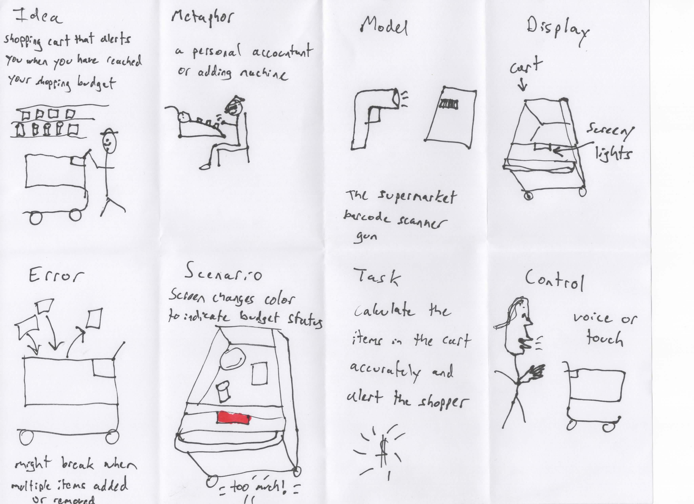
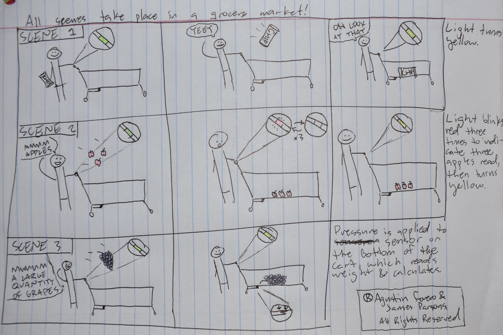

# Staging Interaction

In the original stage production of Peter Pan, Tinker Bell was represented by a darting light created by a small handheld mirror off-stage, reflecting a little circle of light from a powerful lamp. Tinkerbell communicates her presence through this light to the other characters. See more info [here](https://en.wikipedia.org/wiki/Tinker_Bell). 

There is no actor that plays Tinkerbell--her existence in the play comes from the interactions that the other characters have with her.

For lab this week, we draw on this and other inspirations from theatre to stage interactions with a device where the main mode of display/output for the interactive device you are designing is lighting. You will plot the interaction with a storyboard, and use your computer and a smartphone to experiment with what the interactions will look and feel like. 

_Make sure you read all the instructions and understand the whole of the laboratory activity before starting!_

## Scroll down to [Part 2](https://github.com/agforero/Interactive-Lab-Hub/tree/Fall2021/Lab%201#staging-interaction-part-2) to see the second week's work!

## Prep

### To start the semester, you will need:
1. Set up your own Github "Lab Hub" repository to keep all you work in record by [following these instructions](https://github.com/FAR-Lab/Developing-and-Designing-Interactive-Devices/blob/2021Fall/readings/Submitting%20Labs.md).
2. Set up the README.md for your Hub repository (for instance, so that it has your name and points to your own Lab 1) and [learn how to](https://guides.github.com/features/mastering-markdown/) organize and post links to your submissions on your README.md so we can find them easily.
3. (extra: Learn about what exactly Git is from [here](https://git-scm.com/book/en/v2/Getting-Started-What-is-Git%3F).)

### For this lab, you will need:
1. Paper
2. Markers/ Pens
3. Scissors
4. Smart Phone -- The main required feature is that the phone needs to have a browser and display a webpage.
5. Computer -- We will use your computer to host a webpage which also features controls.
6. Found objects and materials -- You will have to costume your phone so that it looks like some other devices. These materials can include doll clothes, a paper lantern, a bottle, human clothes, a pillow case, etc. Be creative!

### Deliverables for this lab are: 
1. Storyboard
1. Sketches/photos of costumed device
1. Any reflections you have on the process
1. Video sketch of the prototyped interaction
1. Submit the items above in the lab1 folder of your class [Github page], either as links or uploaded files. Each group member should post their own copy of the work to their own Lab Hub, even if some of the work is the same from each person in the group.

### The Report
This README.md page in your own repository should be edited to include the work you have done (the deliverables mentioned above). Following the format below, you can delete everything but the headers and the sections between the **stars**. Write the answers to the questions under the starred sentences. Include any material that explains what you did in this lab hub folder, and link it in your README.md for the lab.

## Lab Overview
For this assignment, you are going to:

A) [Plan](#part-a-plan) 

B) [Act out the interaction](#part-b-act-out-the-interaction) 

C) [Prototype the device](#part-c-prototype-the-device)

D) [Wizard the device](#part-d-wizard-the-device) 

E) [Costume the device](#part-e-costume-the-device)

F) [Record the interaction](#part-f-record)

Labs are due on Mondays. Make sure this page is linked to on your main class hub page.

## Part A. Plan 

To stage the interaction with your interactive device, think about:

_Setting:_ Where is this interaction happening? (e.g., a jungle, the kitchen) When is it happening?

_Players:_ Who is involved in the interaction? Who else is there? If you reflect on the design of current day interactive devices like the Amazon Alexa, it’s clear they didn’t take into account people who had roommates, or the presence of children. Think through all the people who are in the setting.

_Activity:_ What is happening between the actors?

_Goals:_ What are the goals of each player? (e.g., jumping to a tree, opening the fridge). 

The interactive device can be anything *except* a computer, a tablet computer or a smart phone, but the main way it interacts needs to be using light.

\*\***Describe your setting, players, activity and goals here.**\*\*

The device here is a shopping cart with a built-in budgeting scale. It features a light that glows more and more red the closer you get to your budget cap. I am working on this with James Parsons, who is also in CS.

_Setting:_ Since it is a shopping cart, the most appropriate setting would be a department store or grocery market -- anywhere where a shopping cart would be used normally.

_Players:_ Within the interaciton itself, the main players are the consumers themselves. Perhaps a store worker would have to occaisionally fix the cart, but otherwise, the main players are people shopping for goods. There are other shoppers there, as well as store workers nearby.

_Activity_: The light on the shopping cart starts green, and glows increasingly redder as the contents of the cart reaches the shopper's inputted budget. Other shoppers and store workers might be able to see this light, which is an important interaction to keep in mind.

_Goals_: The goal of the main player, the shopper, is to stay under an allocated budget. The use of a light makes this visually easier to track.

\*\***Include a picture of your storyboard here**\*\*

_This storyboard was illustrated by James._

\*\***Summarize feedback you got here.**\*\*

## Part B. Act out the Interaction

Try physically acting out the interaction you planned. For now, you can just pretend the device is doing the things you’ve scripted for it. 

**!!! PEER EDITORS: You can find the videos of students demoing the (imaginary) prototype, [here](https://youtu.be/dY1QT0GOFiI) and [here](https://youtu.be/eKWMFM6ovLE). !!!**

\*\***Are there things that seemed better on paper than acted out?**\*\*

\*\***Are there new ideas that occur to you or your collaborators that come up from the acting?**\*\*

## Part C. Prototype the device

You will be using your smartphone as a stand-in for the device you are prototyping. You will use the browser of your smart phone to act as a “light” and use a remote control interface to remotely change the light on that device. 

Code for the "Tinkerbelle" tool, and instructions for setting up the server and your phone are [here](https://github.com/FAR-Lab/tinkerbelle).

We invented this tool for this lab! 

If you run into technical issues with this tool, you can also use a light switch, dimmer, etc. that you can can manually or remotely control.

\*\***Give us feedback on Tinkerbelle.**\*\*

## Part D. Wizard the device
Take a little time to set up the wizarding set-up that allows for someone to remotely control the device while someone acts with it. Hint: You can use Zoom to record videos, and you can pin someone’s video feed if that is the scene which you want to record. 

\*\***Include your first attempts at recording the set-up video here.**\*\*

Now, hange the goal within the same setting, and update the interaction with the paper prototype. 

\*\***Show the follow-up work here.**\*\*

## Part E. Costume the device

Only now should you start worrying about what the device should look like. Develop a costume so that you can use your phone as this device.

Think about the setting of the device: is the environment a place where the device could overheat? Is water a danger? Does it need to have bright colors in an emergency setting?

\*\***Include sketches of what your device might look like here.**\*\*

\*\***What concerns or opportunitities are influencing the way you've designed the device to look?**\*\*

## Part F. Record

\*\***Take a video of your prototyped interaction.**\*\*

\*\***Please indicate anyone you collaborated with on this Lab.**\*\*
Be generous in acknowledging their contributions! And also recognizing any other influences (e.g. from YouTube, Github, Twitter) that informed your design. 

# Staging Interaction, Part 2 

This describes the second week's work for this lab activity.

## Prep (to be done before Lab on Wednesday)

You will be assigned three partners from another group. Go to their github pages, view their videos, and provide them with reactions, suggestions & feedback: explain to them what you saw happening in their video. Guess the scene and the goals of the character. Ask them about anything that wasn’t clear. 

\*\***Summarize feedback from your partners here.**\*\*

## Make it your own

Do last week’s assignment again, but this time: 
1) It doesn’t have to (just) use light, 
2) You can use any modality (e.g., vibration, sound) to prototype the behaviors! Again, be creative!
3) We will be grading with an emphasis on creativity. 

\*\***Document everything here. (Particularly, we would like to see the storyboard and video, although photos of the prototype are also great.)**\*\*

_This is an updated version of the plan written above, according to the new features James and I planned._

The device here is a shopping cart with a built-in budgeting scale. It features a light that glows more and more red the closer you get to your budget cap. If you add fruit, it blinks the color of the fruit x times, where x is the number of fruit being added. It also features a pressure sensor at the bottom of the cart, which weighs weighted items and calculates the added cost to your total (like grapes or broccoli). As before, I am working on this with James Parsons, who is also in CS.

_Setting:_ Since it is a shopping cart, the most appropriate setting would be a department store or grocery market -- anywhere where a shopping cart would be used normally.

_Players:_ Within the interaciton itself, the main players are the consumers themselves. Perhaps a store worker would have to occaisionally fix the cart, but otherwise, the main players are people shopping for goods. There are other shoppers there, as well as store workers nearby.

_Activity_: The light on the shopping cart starts green, and glows increasingly redder as the contents of the cart reaches the shopper's inputted budget. If the shopper adds fruit sold on a by-unit basis, like apples or bananas, the cart will flash the color of the fruit once for every fruit added (for example, adding three apples would cause the cart to blink red three times). Additionally, a pressure sensor at the bottom of the cart weighs items that are on a by-pound basis, like grapes, broccoli and peanuts. It then calculates the additional cost of this food and updates the budget-tracking light.

_Goals_: The goal of the main player, the shopper, is to stay under an allocated budget. The use of a light makes this visually easier to track.

**Updated storyboard:**

## Click [here](https://youtu.be/tRr4QHvQIA8) to view the second set of demos!

## Gallery:

https://github.com/agforero/Interactive-Lab-Hub/tree/Fall2021/Lab%201#staging-interaction-part-2

*I forgot to include these figures when submitting the GitHub link earlier, but here they are :)*